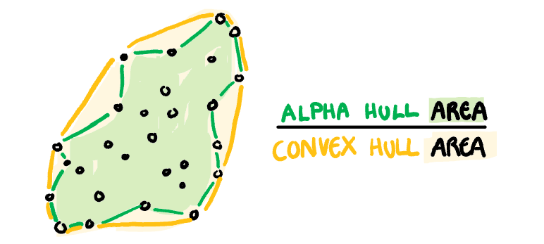

```{r setup, include=FALSE}
options(htmltools.dir.version = FALSE)
knitr::opts_chunk$set(
        echo = FALSE,
        warning = FALSE, 
        message = FALSE,
        fig.retina = 5)
```

```{r loadlibrary, include=FALSE, echo=FALSE}
library(tidyverse)
library(cassowaryr)
library(ggimg)
library(ggstance)
library(fitzRoy)
library(gridExtra)
library(xaringanthemer)
library(GGally)
library(plotly)
```

```{r xaringan-themer, include=FALSE, warning=FALSE}

#generate palette
mypal <- c("#b2182b", "#d53e4f","#FF4E50", "#FC913A", "#fdae61",
           "#F9D423", "#fee08b" , "#abdda4" , "#a6d96a" , "#66c2a5" ,
           "#66bd63","#3B8183", "#3288bd", "#74add1",  "#abd9e9")

style_mono_accent(
  base_color = "#fb8072",
  header_h1_font_size = "2.25rem",
  header_h2_font_size = "1.75rem",
  header_h3_font_size = "1.5rem",
  header_font_google = google_font("Pangolin"),
  text_font_google   = google_font("Pangolin"),
  text_font_size = "1.5rem",
  code_font_google   = google_font("Shadows Into Light Two"),
  code_font_size = "0.5rem"
) 
```

class: center, middle

# Overview
Scatter plots  -  Big data  -  Scagnostics  - Cassowaryr

???
- Hi everyone, so today before I'm going to be talking about the abstract world of scagnostics
- so, scatterplots are particularly useful for examining all kinds of association between variables, 
- but unfortunately big data has too many variables to plot them all, 
- A solution to this are measures known as a scagnostics which measure the visual features of a scatterplot, 
- i've implemented these scagnostics in a new R package called cassowaryr, which ill explain the strutre of 
- then finally to show the practical applications of scagnostics I have an example in exploring AFLW statistics, 

---

# How Have Other people Used Scagnostics?
- Identify interesting sub-sequences from multivariable time series data (TimeSeer) (Dang et al, 2013)
  

- Sample panels from a trellis display (Hafen et al, 2013)
  
- Select good partitioning variables for small multiple displays (Anand et al 2015)
  
- Use them to choose appropriate data transformations (Dang et al, 2014)
  
- Explore interesting low-dimensional random projections of high-dimensional data (Laa et al, 2018)
  

???
- So, we are going to use the scagnsotics on sports data, but where have other people used them
- my favourite is the use in the timeseer paper. 
- In the timeseer paper scagnsotics were used to identify periods of time where two variables, like GDP and Inflation had a similar shape across the scatter plots of countries
- They have an interactive trellis plot made using the package trelliscope and it uses scagnostics in one of its features

---

# The Features Dataset

```{r, Features plot, echo = FALSE, fig.height=8, fig.width=12, out.width = "100%", fig.align='center'}
#plot them
ggplot(features, aes(x,y,colour=feature))+
  geom_point() +
  theme_minimal() + 
  facet_wrap(~feature, ncol=5, scales="free") +
  xlab("") + ylab("") +
  theme(legend.position = "none", 
        aspect.ratio= 1, 
        axis.text = element_blank()) +
  scale_colour_manual(values = mypal)

```

???
- These are a set of unique scatter plots each have some kind of feature that we would want to identify.
- They are also all distinct and we want our scagnostics to be able to tell that,
- the Ring is a hollow version of the disk scatter plot, 
- to capture these unique shapes we are going to need to change the way we see these scatter plots

---


# How Do They Work?

Take the "Ring" scatter plot...
  
```{r, Example Data, include=FALSE, echo=FALSE, warning=FALSE}
example <- features %>% filter(feature=="ring") %>%
  select(x,y)
```

```{r, Ring Scatter,fig.width=6, fig.height=6, fig.align='center', echo=FALSE}
ggplot(example, aes(x,y)) + geom_point(colour = "#3288bd") + theme_minimal() 

```

---

# How Do They Work?

... and strip away everything but it's shape
  
```{r, Void Scatter,fig.width=6, fig.height=6, fig.align='center', echo=FALSE}
ggplot(example, aes(x,y)) + geom_point() + theme_void() + #colour = "#3288bd"
  theme(aspect.ratio=1, axis.text = element_blank()
        ) 
```


???
- we want to remove the numbers and just look at the points in relation to each other
- from here we want to make several objects that represent their shape,

---

# How Do They Work?

... then build the graph based objects

```{r, include=FALSE}
d1 <- draw_convexhull(example$x, example$y) +
  ggtitle("Convex hull") +
  xlab("") + ylab("") +
  theme_void() +
  theme(aspect.ratio=1, axis.text = element_blank())

d2 <- draw_alphahull(example$x, example$y) +
  ggtitle("Alpha hull") +
  xlab("") + ylab("") +
  theme_void() +
  theme(aspect.ratio=1, axis.text = element_blank())

d3 <- draw_mst(example$x, example$y) +
  ggtitle("Minimum Spanning Tree (MST)") +
  xlab("") + ylab("") +
  theme_void() +
  theme(aspect.ratio=1, axis.text = element_blank())
```

```{r, echo=FALSE, fig.align='left', fig.height=6, fig.width=15, warning=FALSE}
grid.arrange(d1,d2,d3, nrow=1)

```


???

- the convex hull, the shape we would get if we stretched a rubber band around the outside of the MST
- the alpha hull is made by tracing around the outside of the shape
- the MST is the minimum spanning tree, that is, we join up all the dots using as little edges as possible
- using these three objects we can define our scagnostics
---

# How Do They Work?
... Convex using the alpha convex hull
  
.center[]

???
- an example of a hull based scagnostic is convex, it just takes the ratio of the two hull areas

---

# How Do They Work?

... Outlying using the MST
  
.center[]

???
- outlying is an example of an minimum spanning tree object
- we first identify the outlying points and the length of their edges, then we calculate how much of the total MST length is due to these outling edges

---

# How Do They Work?

... and Splines using the original data

.centre[]

???
- splines is an example of an association measure, so it take in the raw data
- it calculates a two splines models, one with x as a dependent variable and one with y as the dependent variable
- if either of these splines models have very low variance in their residuals, the splines scagnostic will be high

---

# The Scagnostics
.pull-left[
- Convex and Alpha Hull Measures
    + Convex
    + Skinny
]
--
.pull-right[
- MST Measures
    + Outlying
    + Clumpy*
    + Striated*
    + Sparse
    + Skewed
    + Stringy
]
--

- Association Measures
    + Monotonic
    + Splines
    + Dcor


???
- This is a list of all the working scagnostics sorted into their three groups
- Those with an astrix have two versions, the ones from the original scagnostic distributions paper as well as an adjustment made by me. 

---

# Assessing the Scagnostics

- All are on a uniform scale: 0-1, where 0 is low and 1 is high
  
- The ordering by scagnostic value hopefully matches how we perceive the structure, but it doesn't always
  
- Scagnostics hopefully identify different features but some are correlated with each other

 

???

- We want to assess the current scagnostics before we make any changes to them, yknow, make sure they work as intended
- We want them on a uniform scale so they are directly comparable
- we also want them to order the scatter plots from something like the features data in a way that lines up with human intuition, it wont always happe, but most of the time
- If they have high correlation the second scagnsotic is adding less to the package, but sometimes it is required for the scagnostics to be correlated, just because they are looking for similar things

---

# A Scagnostic Visual Table

```{r, Scag Calculation, include=FALSE}
# run scagnostics
features_scagnostics_wide <- features %>%
  group_by(feature) %>%
  summarise(calc_scags(x,y)) #%>%
  #select(-clumpy_adjusted)

#long version of
features_scagnostics_long <- features_scagnostics_wide %>%
  pivot_longer(cols=outlying:dcor, names_to = "scagnostic")

#transpose of wide feature scagnostics table
t_features_scagnostics_wide <- features_scagnostics_long %>%
  pivot_wider(names_from = "feature")
```

```{r, Scatter Plots as images,  include=FALSE, eval=FALSE}

#set theme so all scatter plots in table match
plot_theme <-  theme_void() + #theme_minimal() + 
  theme(aspect.ratio=1, axis.title=element_blank(), axis.text = element_blank(), 
        panel.grid.major = element_blank(), panel.grid.minor = element_blank(),
        #panel.border = element_rect(colour = "black", fill=NA, size=5),
        legend.position = "none"
        )

#save scatter plots as images
plots <- sort(unique(features$feature))

for (i in seq(length(plots))){
  holdplot <- features %>% 
    filter(feature==plots[i]) %>% 
    ggplot(aes(x,y, size=2))+ geom_point(colour=mypal[i]) + plot_theme +
    theme(panel.border = element_rect(colour = mypal[i], fill=NA, size=5))
    ggsave(paste0("figures/", plots[i], ".png"),holdplot) #files already in /figure/
}

```


```{r, Table of Plots, include=FALSE}

# edit data frame
plot_path_data <- features_scagnostics_long %>%
  mutate(plotad = paste0("figures/", feature, ".png"))

# which plots to include in visual table
whichplots <- function(scag, feature){
  pad = FALSE
  # Alphahull measures
  if(all(scag=="convex", feature %in% c("discrete", "ring", "l-shape"))){
    pad = TRUE
  }
  if(all(scag=="skinny", feature %in% c("line", "positive", "disk"))){
    pad = TRUE
  }
  
  # MST measures
  if(all(scag=="outlying", feature %in% c("outliers2","l-shape", "outliers"))){
    pad = TRUE
  }
  if(all(scag=="stringy", feature %in% c("nonlinear1", "gaps"))){
    pad = TRUE
  }
  if(all(scag=="striated", feature %in% c("vlines", "discrete", "weak"))){
    pad = TRUE
  }
  if(all(scag=="clumpy", feature %in% c("vlines", "clusters", "nonlinear"))){
    pad = TRUE
  }
  if(all(scag=="sparse", feature %in% c("weak", "line"))){
    pad = TRUE
  }
  if(all(scag=="skewed", feature %in% c("l-shape", "barrier"))){
    pad = TRUE
  }
  
  # Association Measures
  if(all(scag=="monotonic", feature %in% c("line", "positive", "discrete"))){
    pad = TRUE
  }
  if(all(scag=="splines", feature %in% c("nonlinear2", "clusters", "vlines"))){
    pad = TRUE
  }
  if(all(scag=="dcor", feature %in% c("positive", "barrier", "gaps"))){
    pad = TRUE
  }
  pad
}

# Make Visual Table
# Data
plot_data <- plot_path_data %>%
  group_by(scagnostic, feature) %>%
  mutate(doplot = whichplots(scagnostic, feature)) %>%
  ungroup() %>%
  filter(doplot==TRUE)

# so i dont have to keep adjusting the image size
s <- length(unique(plot_data$feature))

# plot
visual_table <- ggplot(plot_data, aes(x=value , y=scagnostic, colour=feature))+
  geom_point_img(aes(img = plotad), size = 1.25) + 
  xlim(-0.1,1.1) +
  scale_size_identity()+
  xlab("Value") +
  ylab("Scagnostic") +
  scale_colour_manual(values = mypal) +
  theme_classic() +
  theme(
    panel.grid.major.y = element_line(),
    panel.grid.minor = element_blank(),
    legend.position = "none",
    axis.line = element_blank(),
    strip.background = element_blank(),
    strip.text.x = element_blank(),
)
#ggsave("figures/visual_table.png", visual_table, width=10, height=10)
```

```{r, Show Visual Table, echo=FALSE, fig.height=6, fig.width=9, out.width = "100%", fig.align='center'}
visual_table
```

???

- This visual table shows all the scagnostic defined in previous literature
- On the x axis is the scagnostic value
- On the y axis are the scagnostics
- The points are scatter plots from the features data, each scagnostic has an example of a low value, a high value, and a moderate value, if it fits.
- Here we can see the scagnostics working as intended
- for example Stringy places a deterministic relationship above a random one
- if you are paying close attention you may have noticed that the scagnostics based on the MST are the ones that most freuently have only 1 plot, and that their distributions are regularly condensed into a smaller set of values
- This is a small issue we ran into with the package
- all previous work in scagnostics had binning as a pre processing step, we want binning to be optional in the cassowaryr package
- when we removed binning and allowed for infinitely small edges in the MST, it warped a few of the scagnostics
- and so to allow for this I have designed some adjusted scagnostics

---


# Clumpy Adjusted (Current Work)

```{r,  Clumpy Comparison, include=FALSE}
plot_data_clumpy <- plot_path_data %>%
  group_by(scagnostic, feature) %>%
  mutate(doplot = ifelse(all(scagnostic %in% c("clumpy","clumpy_adjusted"), 
                             feature %in% c("vlines", "clusters","barrier", "outliers", "nonlinear1", 	
"nonlinear2")),
                         TRUE,
                         FALSE)) %>% 
  ungroup() %>%
  filter(doplot==TRUE)


# plot
clumpy_visual_table <- ggplot(plot_data_clumpy, aes(x=value , y=scagnostic))+
  geom_point_img(aes(img = plotad), size = 2, 
                 position=ggstance::position_dodgev(height=0.9)) +
  xlim(-0.05,1.05) +
  scale_size_identity()+
  xlab("Value") +
  ylab("Scagnostic") +
  #ggtitle("Clumpy Comparison") +
  theme_classic() +
  theme(
    panel.grid.major = element_blank(), 
    panel.grid.minor = element_blank(),
    legend.position="none",
    axis.line = element_blank(),
    strip.background = element_blank(),
    strip.text.x = element_blank(),
    panel.grid.major.y = element_line(),
    axis.text.y = element_text(size = rel(1.5))
)
#ggsave("figures/clumpy_visual_table.png", clumpy_visual_table, width=10, height=10)
```

```{r, Clumpy Table, echo=FALSE, fig.height=8, fig.width=12, out.width = "100%", fig.align='center'}
clumpy_visual_table
```
???
- Here is the same visual table but we are only plotting clumpy with clumpy_adjusted
- you can see clumpy adjusted both does a better job of identifying the clusters plot as it appears relatively higher on the measure and also is more uniform from 0 to 1.
- This measure is still being adjusted, but even in its current state it performs quite well.

---
# AFLW Example: The Data

- Australian Football League Women's
  
- Data from the 2020 Season
  
- 68 variables, 33 of which are numeric

- 528 Scatter Plots
  
- What are we expecting the scagnostics to find?
  
  
???
- While it is nice to know that the scagnostics work, correctly ordering scatter plots is not what they are going to be used for, the measures need to be able to pick out interesting scatter plots from a large selection of scatter plots
- In order to do show that they do, in fact do this, I'm going to give an example using data from the AFLW 2020 season
- This data set is large, and has more pairs of variables than we could plot ourselves
- Hopefully the scagnostics will pick out some interesting pairs of variables

---
# AFLW Example: Quiz!
```{r, include=FALSE, eval=FALSE}

aflw <- fetch_player_stats(2020, comp = "AFLW")

load("data/aflw.rda")

aflw_num <- aflw %>%
  select_if(is.numeric)

aflw_num <- aggregate(aflw_num[,5:37], 
  list(aflw$player.player.player.surname),
  mean)
save(aflw_num, file="data/aflw_num.rda")

AFLW_scags <- calc_scags_wide(aflw_num[,2:34])
save(AFLW_scags, file="data/AFLW_scags.rda")
```

```{r, AFLW Scatter Plots, echo=FALSE, fig.height=5, fig.width=9, out.width = "95%", fig.align='center'}
load("data/aflw.rda")
load("data/aflw_num.rda")
load("data/AFLW_scags.rda")

mypal <- c("#FF4E50", "#fdae61","#fee08b", "#66c2a5", "#3288bd", "#abd9e9")

#standounts from splom
#outlying and Skewed + highest skinny not 1
p1 <- ggplot(aflw_num, aes(x=disposalEfficiency, y=hitouts, label=Group.1)) + 
  theme_classic()+
  ggtitle("Plot 1") + 
  geom_point(colour=mypal[1]) 

#high on the 3 associations measures
p2 <- ggplot(aflw_num, aes(x=totalPossessions, y=disposals, label=Group.1)) + 
  theme_classic()+
  ggtitle("Plot 2") + 
  geom_point(colour=mypal[2]) 

#low on sparse and high on convex
p3 <- ggplot(aflw_num, aes(x=marksInside50, y=goals)) + 
  theme_classic()+
  ggtitle("Plot 3") + 
  geom_point(colour=mypal[3]) 

#high on clumpy adjusted, low on monotonic
p4 <- ggplot(aflw_num, aes(x=onePercenters, y=handballs)) +
  theme_classic()+
  ggtitle("Plot 4") + 
  geom_point(colour=mypal[4]) 

#interesting HIGH on striated, moderate on outlying
p5 <- ggplot(aflw_num, aes(x=bounces, y=hitouts, label=Group.1)) + 
  theme_classic()+
  ggtitle("Plot 5") + 
  geom_point(colour=mypal[5]) 

# me randomly picking two variables
p6 <- ggplot(aflw_num, aes(x=kicks, y=handballs)) + 
  theme_classic()+
  ggtitle("Plot 6") + 
  geom_point(colour=mypal[6])

grid.arrange(p1, p2, p3, p4, p5, p6,  nrow=2)
```

Which of these scatter plots was not identified  (have a high value) by scagnostics?

???
- Ok time for a bit of fun
- So, we run the scagnostics on this data and it tells us how interesting each scatter plot is
- 5 of these scatter plots had a high value, or a strange combination on one or more of the 11 scagnostics
- one of them were just two variables I plotted against each other not really knowing what they looked like
- Ill give you 10 seconds to type in the chat which plot number you think was the one I picked at random
- I have quizzed a few people on this already, among people who know nothing about statistics there is a 50% success rate, among people who are somewhat educated in statistics there is a 0% sucess rate

---
# AFLW Example: Plot 6!
- Plot 6! 
  
```{r, 3 Random Plots, echo=FALSE, fig.height=3, fig.width=9, out.width = "100%", fig.align='center'}
p7 <- ggplot(aflw_num, aes(x=goals, y=clangers)) + 
  geom_point() +
  theme_classic()+ 
  ggtitle("Another Plot") 

p8 <- ggplot(aflw_num, aes(x=totalPossessions, y=metresGained)) + 
  geom_point() +
  theme_classic()+
  ggtitle("and Another Plot") 

grid.arrange(p6, p7, p8, nrow=1)

```

???
- It was plot 6! I picked the two variables that were the easiest to spell.
- Here is plot 6 alongside w other plots that were chosen by me without knowing what they would look like
- but, how did I use scagnostics to pick the other 5? well let me explain
  
---
# AFLW Example: Plot 1

```{r, Red Scatter, include= FALSE, echo=FALSE, fig.height=3, fig.width=9, out.width = "100%", fig.align='center'}
test <- AFLW_scags %>%
  mutate(lab = paste0(Var1, ", ", Var2)) %>%
  mutate(plot1=ifelse(lab=="disposalEfficiency, hitouts", TRUE,FALSE),
         plot2=ifelse(lab=="totalPossessions, disposals", TRUE,FALSE),
         plot3=ifelse(lab=="marksInside50, goals", TRUE,FALSE),
         plot4=ifelse(lab=="onePercenters, handballs", TRUE,FALSE),
         plot5=ifelse(lab=="hitouts, bounces", TRUE, FALSE)
         ) %>%
  mutate(plotted = any(plot1,plot2,plot3,plot4, plot5))
s1 <- ggplot(test, aes(x=outlying, skewed, colour=plot1, label=lab)) + 
  geom_point() +
  theme_classic() +
  theme(legend.position ="none")+
  scale_colour_manual(values=c("grey", mypal[1]))+
  ggtitle("Relevant Scagnostics Plot")
#grid.arrange(p1, s1, nrow=1)
```

.pull-left[
```{r, Red p1, echo=FALSE, warning=FALSE, fig.height=6, fig.width=6, out.width = "100%"}
ggplotly(p1)%>%
  config(displayModeBar = FALSE)
```
]
.pull-right[
```{r, Red p2, echo=FALSE, fig.height=6, fig.width=6, out.width = "100%"}
ggplotly(s1)%>%
  config(displayModeBar = FALSE)
```
]

???
- Plot 1 was high on outlying and skewed
- This means that even after removing outliers, the data was still really spread out
- This is clearly visible in the scatter plot
- These plots are interactive, so we can check the scagnostic plot to see which plots have skewed distributions, and then we can check the AFLW plot to see which  players are skewing the distribution

---

# AFLW Example: Plot 2

```{r, Organge Scatter, include=FALSE, echo=FALSE, fig.height=4, fig.width=8, out.width = "100%", fig.align='center'}
s2 <- ggplot(test, aes(x=splines, dcor, colour=plot2, label=lab)) + 
  geom_point() +
  theme_classic() +
  theme(legend.position ="none")+
  scale_colour_manual(values=c("grey", mypal[1]))+
  ggtitle("Relevant Scagnostics Plot")
#grid.arrange(p2, s2, nrow=1)
```

.pull-left[
```{r, organge p1, echo=FALSE, warning=FALSE, fig.height=6, fig.width=6, out.width = "100%"}
ggplotly(p2)%>%
  config(displayModeBar = FALSE)
```
]
.pull-right[
```{r, orange p2, echo=FALSE, fig.height=6, fig.width=6, out.width = "100%"}
ggplotly(s2)%>%
  config(displayModeBar = FALSE)
```
]

???
- This plot is really high on the association measures
- usually a plot that deviates from this big mass, in the middle has a non-linear relationship in the scatter plot
- we dont have that here, so total posessions and disposals have the strongest linear relationships
- total posessions is the number of times you have the ball, disposals is the number of times you got rid of it legally
- that makes sense since this is a profesisonal league, so most of the time a player is getting rid of the ball it is legally.

---
# AFLW Example: Plot 5

```{r, Blue Scatter, include=FALSE, echo=FALSE, fig.height=4, fig.width=8, out.width = "100%", fig.align='center'}
s5 <- ggplot(test, aes(x=outlying, y = striated_adjusted, colour=plot5, label=lab)) +
  geom_point() +
  theme_classic() +
  theme(legend.position ="none") +
  scale_colour_manual(values=c("grey", mypal[5])) +
  ggtitle("Relevant Scagnostics Plot")

#grid.arrange(p5, s5, nrow=1)

```

.pull-left[
```{r, blue p1, echo=FALSE, warning=FALSE, fig.height=6, fig.width=6, out.width = "100%"}
ggplotly(p5)%>%
  config(displayModeBar = FALSE)
```
]
.pull-right[
```{r, blue p2, echo=FALSE, fig.height=6, fig.width=6, out.width = "100%"}
ggplotly(s5)%>%
  config(displayModeBar = FALSE)
```
]

???
- This plot is the last we will look at, and its my favourite
- it was identifiable because it was high on striated adjsuted and low on outlying, so all the points are at right angles and a little spread out
- The reason I love this plot is its not about player position, but rather physical skill of AFL players.
- In the plots with lower triangualr structures like plot 4, midfielders covered the gap between defenders and forwards, here it is clear almost nobody does both bounces and hitouts
-  hitouts are when you punch the ball when the ref throws it back in and they are done by your tall players, bounces have to be done while running so they are done by your fast players
- in AFL these two categories seem to have no overlap
- I find that so strange

---


# The CassowaryR Package
## Structure

- Calculate Functions   
    + Wide and Long Versions  
    + Graph Construction  
    + Outlier Removal  
    + Scagnostic Calculations  
--
- Draw Functions  
    + MST, Convex Hull and Alpha hull
--

## Name

CAlculate Scagnostics on Scatterplots Over Wads of Associated Real numberYs in R

???
- now I know what you are all thinking
- Wow thats so cool I wish I could do scagnsotic analysis
- well, now you can
- the Cassowary R packages has been written so you can incorperate calculating scagnostics into your tidy data workflow
- the package basically has two main features, the calculate functions which calculate the scagnostics for you, and the draw functions which draw the graph objects so you can better understand the calculations outputs
- The name is an acronym (if we get really liberable with the term acronym) and it stands for  CAlculate Scagnostics on Scatterplots Over Wads of Associated Real numberYs in R
  
---
# Future Timeline
## Feasible
- Fine tune the examples with the adjusted scagnostics
- R Journal Paper
  
## Probably not Feasible
- Hexagonal Binning
  
## Not Feasible
- Improve Speed of Calculations

???
- What is next for for cassowaryR package
- First I want to finish the adjusted scagnostics
- and then hopefully publish the thesis as a paper in the R journal
- If i have any time left I want to implement hexagonal binning into the package so it can be used on very large datasets
- Becuase improving the calculation speed of the current scagnostics is a bit of a pipe dream.

---
class: centre, middle
# Thanks for Listening

- R package: https://github.com/numbats/cassowaryr
- Paper: https://github.com/harriet-mason/paper-cassowaryr (private)
- Slides: https://github.com/harriet-mason/presentation-cassowaryr (private)

???
- Thanks for listening,
- here is the link to the package if you want to have some fun with scagnostics
- And I'm now happy to take any questions
  
---
